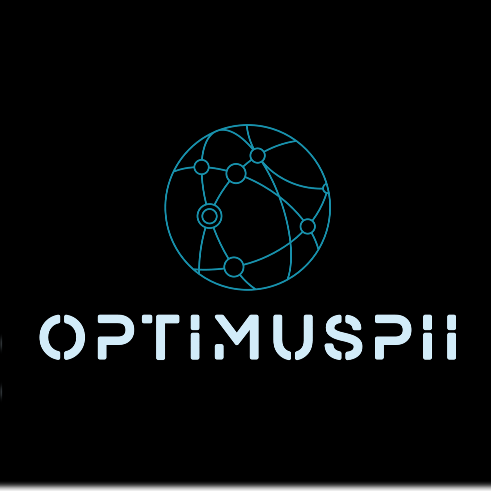

# OptimusPII

  

A comprehensive security extension that protects against leaking PII (Personally Identifiable Information) through advanced detection, blocking, and redaction capabilities in ChatGPT, Claude, and other web applications, with customizable policies, multi-mode operation, and robust security monitoring features.

## Features

- **Intelligent PII Detection**: Real-time scanning for various PII types (emails, credit cards, phone numbers, SSNs, passport numbers, Aadhaar numbers, PAN cards, passwords) with support for custom regex patterns
- **Flexible Protection Options**: Multiple operational modes including interactive confirmation, automatic blocking, alert-only, silent blocking, and redaction capabilities
- **Customizable Security**: Tailor protection with website-specific rules, custom replacement text, and configurable URL monitoring
- **Policy Management**: Create, apply and manage domain-specific security policies through an intuitive interface
- **Comprehensive Monitoring**: Track security events through alerts dashboard, detailed activity logs, and configurable notification system
- **Network Security**: Detection and warning system for potentially malicious phishing URLs and other threats

## Development Features

- **Testing Framework**: Built-in tools to validate detection patterns and extension functionality
- **Webpack Configuration**: Optimized build process for both development and production environments
- **Component-Based Architecture**: OOP-based structure for content script allowing easier maintenance and future enhancements
- **React UI Framework**: Modern React-based options page with component structure for better development experience
- **Theme Support**: Built-in light and dark theme support with Bootstrap styling
- **Hot Reloading**: Development environment with watch mode for faster development cycles
- **Cross-Browser Compatibility**: Configurations for both Chrome and Firefox development

## Screenshots

1. Interactive Module for Blocking or Allowing

2. Notifications for other modes if paste is directly blocked or detected in alert mode

Block Mode

Alert Mode

Redact & Paste

3. Policy Based Configurations

4. Global Settings

5. Alerts Page

6. Logs Page

7. Dark Mode

8. Phishing Warning Page

9. Alert Notifications

## How it works

The extension monitors paste events on web pages and checks for patterns that match known PII formats. When detected, it can block the paste operation and/or notify the user based on the selected operational mode.

## PII Detection Types

- **Email Addresses**: Standard email format detection
- **Credit Card Numbers**: Major card formats (Visa, Mastercard, Amex, etc.) with or without spaces/dashes
- **Phone Numbers**: Various international formats with different separators and country codes
- **Social Security Numbers**: US SSN formats (XXX-XX-XXXX, XXX XX XXXX, or XXXXXXXXX) with validation rules
- **Passport Number**: Common international passport number formats
- **Aadhaar Number**: Indian national ID number format
- **PAN Card**: Indian tax ID format
- **Passwords**: Common password patterns with symbols, numbers, and mixed case
- **Custom Patterns**: User-defined regex patterns for detecting specific types of sensitive information
- **Phishing URLs**: Detection of potentially malicious URLs with configurable sensitivity levels

## Developer Installation

### Chrome/
1. Download the source code
2. Go to `chrome://extensions/` (Chrome)
3. Enable "Developer mode"
4. Click "Load unpacked"
5. Select the extension folder ( If issues rename manifest_chrome.json to manifest.json )

### Firefox
1. Download the source code
2. Go to `about:debugging#/runtime/this-firefox`
3. Click "Load Temporary Add-on"
4. Select the manifest_firefox.json file ( If issues rename manifest_firefox.json to manifest.json )

## Supported Websites

By default, the extension monitors:
- ChatGPT (https://chatgpt.com/*)
- Claude AI (https://claude.ai/*)

You can add or remove website patterns through the options page.

> Note : Tested it on google also, it works. Don't give them everything.

## Configuration Options

Access the extension options to customize how OptimusPII works:

1. **Operation Mode**: Select how the extension should respond to detected PII
   - Interactive mode provides a detailed popup showing detected information
   - Other modes provide varying levels of blocking and notifications

2. **Websites to Monitor**: Customize which websites the extension should monitor
   - Add new websites using URL patterns like "https://example.com/*"
   - Use wildcard patterns like "*://*.example.com/*" to match all protocols and subdomains

3. **Built-in Detection Patterns**: Toggle and customize default patterns
   - Enable/disable specific types of detection
   - Customize sample replacement text for each pattern
   - View the regex pattern being used for detection

4. **Custom Detection Patterns**: Add your own regex patterns to detect specific types of sensitive information
   - Name your pattern (e.g., "API Key", "Database Password")
   - Provide a regex pattern to match the sensitive information
   - Set sample replacement text for when using "Paste Redacted" option
   - Enable/disable patterns as needed

5. **Network Security Settings**: Configure protection against malicious content
   - Adjust phishing URL detection sensitivity
   - Control notification preferences for different security events
   - Enable/disable specific security features

6. **Policy-Based Protection**: Manage policies to control security behaviors
   - Create policies to define specific detection and blocking rules
   - Apply policies to specific websites or domains
   - Enable, disable, or customize policies through the options interface
